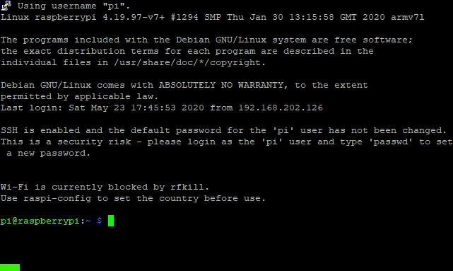

# Installing n8n-pi
There are two ways to install n8n-pi; the easy way and the DIY way. We will cover both of these.

## Assumptions
For this installation, we are making the following assumptions. If this does not fit your situation, you may need to do...something. Learn a new skill... Buy (borrow) some inexpensive hardware...stuff like that!
* You have a Raspberry Pi 3 (This is what we did our testing on)
* You have a microSD card
* You are comfortable with working in a Linux environment from the command line
* You have internet access
* You are familiar with SSH and connecting to remote systems with SSH
* You have an open network port on your network switch and a patch cable that can plug into the RPi
* Your network runs DHCP
* You know how to write disk images to a microSD card
* You have the ability to put a microSD card into your computer and see it from your operating system
* You have the following tools installed on your computer:
  * SSH client (e.g. [PuTTY](https://www.chiark.greenend.org.uk/~sgtatham/putty/))
  * Disk imaging software (e.g. [Raspberry Pi Imager](https://www.raspberrypi.org/downloads/))

# Easy Install
This option will get you up and running the quickest. You should be ready to start building your first flows in a few miutes.
## Overview
Essentially:
1. Download the image
1. Write the image to a microSD card
1. Boot the RPi
1. Point your browser to http://<RPi.IP.address>:5678

## Download the Image
To do

## Write the Image to microSD card
To do

## Boot the RPi
To do

## Got to http://<RPi.IP.address>:5678
To do

# DIY Install
The DIY installation allows you to get your hands dirty by using the same installation scripts that I do for building the n8n-pi system. This way, if you want to customize or tweak your installation, then it's easy to do. Simply edit the files from the repository and go from there.

## Quick Instructions
If you are familiar with the Raspberry Pi hardware and Raspbian/Debian, these may be all the instructions that you need:
1. Build Raspbian Lite microSD card with SSH enabled
1. Boot RPI from microSD card
1. SSH to RPi
1. Run `wget --no-cache -O - https://raw.githubusercontent.com/TephlonDude/n8n-pi/master/scripts/build-n8n-pi-1.sh | bash`
1. Follow the prompts

## Detailed Instructions
For those of you who need a bit more detail, here are the instructions for you. They are based specifically on installation from a Windows 10 system.

>**P.S.** If anyone wants to contribute detailed instructions on how to do this from a different OS (i.e. Mac or Linux, I'd be happy to put it on here and give you the credit!)
### Build Raspbian Lite microSD card
1. Download a copy of the [Raspian Lite image](https://www.raspberrypi.org/downloads/raspbian/). All testing and builds for this project have been done with the Raspbian Buster Lite image released on 2020-02-13.
1. Write the recently downloaded image to a microSD card.
1. When the image has been completely written to the microSD card, remove it from your system
#### References
* [Raspberry Pi Imager](https://www.raspberrypi.org/downloads/)
* [SD Card Requirements](https://www.raspberrypi.org/documentation/installation/sd-cards.md)
* [Installing Images](https://www.raspberrypi.org/documentation/installation/installing-images/README.md)

### Enable SSH
1. Re-insert the microSD card back into your computer system
1. Find the drive/mount point where the first partition on the microSD card is located. You will know you have the right location because it will have a file called `kernel.img` on it
1. In this same location, create an empty file called `SSH`. It should have no extension and no content
>**Windows Users**: This is often where Windows users end up with an issue because the file extensions are hidden on their system and it appears that the file has not extension when it actually does. If you are having difficulty with this, please check out this [article](https://www.bleepingcomputer.com/tutorials/how-to-show-file-extensions-in-windows/)
4. Remove the microSD card from your computer

### Boot Raspberry Pi from microSD card
1. Ensure the power is disconnected from the Raspberry Pi
1. Place the microSD card into the Raspberry Pi
1. Plug in a network cable between your Raspberry Pi and your network switch
1. Plug in power to the Raspberry Pi
1. Wait for the Raspberry Pi to boot up

### SSH to Raspberry Pi
1. Determine the IP address of the Raspberry Pi. There are several ways to do this remotely depending on how your network is configured and the operating system you are using but the easiest way is to connect a keyboard and a monitor to the Raspberry Pi and enter in the command:
    ```bash
    ifconfig | grep -Eo 'inet (addr:)?([0-9]*\.){3}[0-9]*' | grep -Eo '([0-9]*\.){3}[0-9]*' | grep -v '127.0.0.1'
    ```
2. Open up your SSH client and connect to the Raspberry Pi using the IP address you discovered
1. Log into the session with the default username and password for the Raspbian OS:
    * **Username:** *pi*
    * **Password:** *raspberry*
#### Resources
* [How to Scan for Any Device IP Address on a Network With Tools](https://www.dnsstuff.com/scan-network-for-device-ip-address)

### Perform the Installation
1. From the command prompt, enter the following to download and run the installation script:
    ```bash
    wget --no-cache -O - https://raw.githubusercontent.com/TephlonDude/n8n-pi/master/scripts/build-n8n-pi-1.sh | bash
    ```
2. Follow the onscreen instructions to complete the first part of the installation

3. Once the Raspberry Pi has rebooted, SSH back into the system using the **new username and password**:
    * **Username:** *n8n*
    * **Password:** *n8n=gr8!*
    This is very important because if you do not use this username and password, the installation will not continue.
4. The next part of the installation will automatically start up when you log in. Follow the onscreen instructions to complete the second part of the installation (Animated GIF to follow!)
