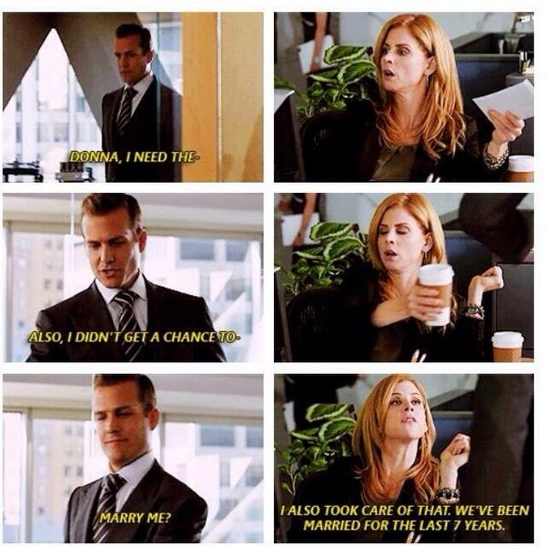
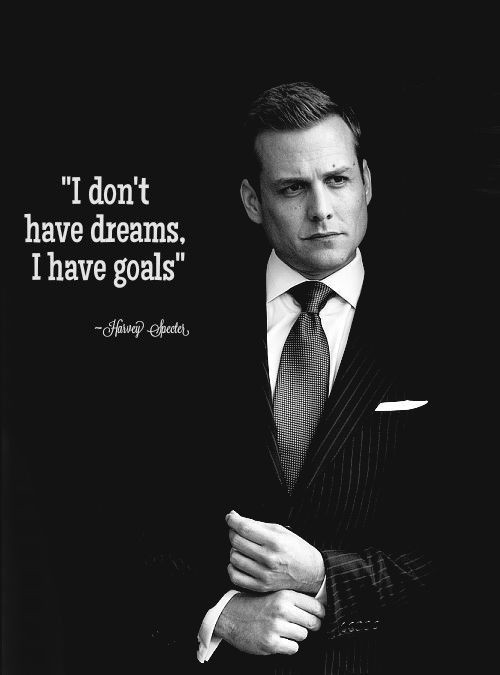

# Virtual Donna: Building Your Perfect Personal Assistant

## We All Need a Donna!

If you've watched even just one episode of the television series <a href="https://www.usanetwork.com/suits" target="_blank">Suits</a>, it becomes pretty apparent almost immediately that, despite all of his self confidence, <a href="https://suits.fandom.com/wiki/Harvey_Specter" target="_blank">Harvey</a> would not be where he is today without <a href="https://suits.fandom.com/wiki/Donna_Paulsen" target="_blank">Donna</a>.

Donna knows what Harvey wants before Harvey does. Donna anticipates Harvey's needs and acts on them so that by time Harvey realizes he needs something, Donna has already done it. She is the glue that holds his life together.

If we are being honest with ourselves, I think we could all use our own Donna! Wouldn't it be wonderful if all the little picky details in life were taken care of?

Well, I may have some good newd for you!

## Virtual Donna At Your Service

While it would be impossible to completely recreate the <a href="https://www.youtube.com/watch?v=3TMNcCquWhg" target="_blank">awesome that is Donna</a>, we can definitely but together a useful virtual assistant who can deal with some of the day to day details that somehow find a way to consume your life!

In this article, we are going to show you how to build your very own virtual Donna using many of the services that you already use today and connecting them all together with <a href="https://n8n.io" target="_blank">n8n</a>.

## Goals

There is very little chance that you are going to arrive where you want to if you don't set a goal. And this project is no exception. So we are going to set some specific short term goals which we will complete during this article and then some long term goals which are ideas I think we can add-on at a later date once we build this initial framework.

### Short Term Goals
* Set up a to communicate with Virtual Donna
* Give Virtual Donna access to manage:
  * Mail
  * Calendar
  * Tasks
  * Video Conferencing
* Give Virtual Donna some sass!

### Long Term Goals
In the long term, we'd love to get Virtual Donna to:
  * Make purchases online
  * Speak and be spoken to
  * Make dinner reservations
  * Order coffe or supper
  * Make phone calls
  * Provide reminders based on time to travel to meeting
  * Manage smart devices
  * Send a dictated email
  * Monitor daily step count
  * Manage text messages
  * Recommend a new recipe
  * Order groceries
  * Manage kitchen
  * Sell stuff online (and handle negotiations)
  * Recommend a movie
  * Manage to do lists
  * Assign work to employees
  * Send out invoices for completed work
  * Update the company website
  * Monitor competition's Twitter accounts and respond accordingly
  * Write and send out the company newsletter
  * Whatever else comes to mind!

## Tools and Services

### n8n
The core of our Virtual Donna is the <a href="https://n8n.io" target="_blank">n8n</a> system. It has two primary purposes:
1. Connect services together that do not presently talk together
2. Provide the logic for how these services interact

### Other Services
We are also going to be using a number of other services, all of which are available online at no cost. These include:
* GMail
* Google Calendar
* Google Tasks
* Telegram
* Discord
* Slack

## Assumptions

