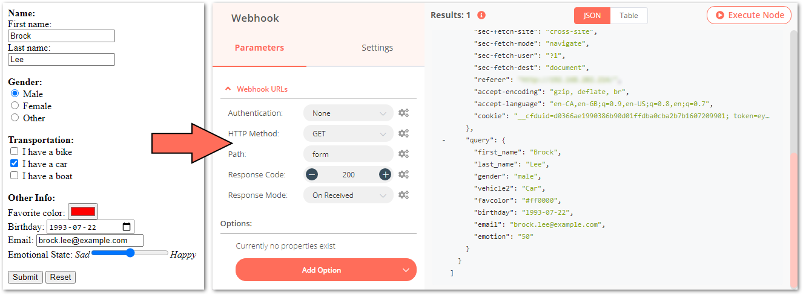

# Submitting Form Information to n8n
A quick proof of concept showing how to submit form information to n8n.

## Assumptions
1. You have access to a working web server with the ability to add files
2. You have a working instance of n8n with access to webhooks
    - either n8n is accessible directly from the internet or
    - is being run with the `--tunnel` option

## Build the webform
1. Copy the following to workflow into the n8n editor UI:
```  XML
  {
  "name": "Form Test",
  "nodes": [
    {
      "parameters": {},
      "name": "Start",
      "type": "n8n-nodes-base.start",
      "typeVersion": 1,
      "position": [
        250,
        300
      ]
    },
    {
      "parameters": {
        "path": "form",
        "options": {}
      },
      "name": "Webhook",
      "type": "n8n-nodes-base.webhook",
      "typeVersion": 1,
      "position": [
        450,
        450
      ],
      "webhookId": "1aa2c0b2-06e2-4bd6-9e20-404252783d7b"
    }
  ],
  "connections": {},
  "active": false,
  "settings": {},
  "id": "6"
}
```
2. Determine the URL for the webhook and note for later.
3. Save workflow.

## Create the Webform
1. Create an HTML file
2. Enter the following as content:

``` HTML
<!doctype html>

<html lang="en">
    <head>
        <meta charset="utf-8">

        <title>Tephlon n8n POC</title>

        <meta name="description" content="n8n POC">
        <meta name="author" content="Tephlon">
    </head>

    <body>
        <form action="https://tephlon.app.n8n.cloud/webhook-test/form">
            <label for="first_name">First name:</label><br>
            <input type="text" id="first_name" name="first_name" value="Brock"><br>
            <label for="last_name">Last name:</label><br>
            <input type="text" id="last_name" name="last_name" value="Lee"><br>
            <br>
            <input type="submit" value="Submit">
        </form>
    </body>
</html>
```
3. Replace `https://tephlon.app.n8n.cloud/webhook-test/form` with the webhook URL noted earlier.

## Testing Form and Webhook
1. In the n8n editor UI editor, open the Webhook node
2. Click the *Execute Node* button
3. In your web browser, browse to the web form you created
4. Change inputs as desired
5. Press the *Submit* button
6. You should see your submitted results in the Webhook node

